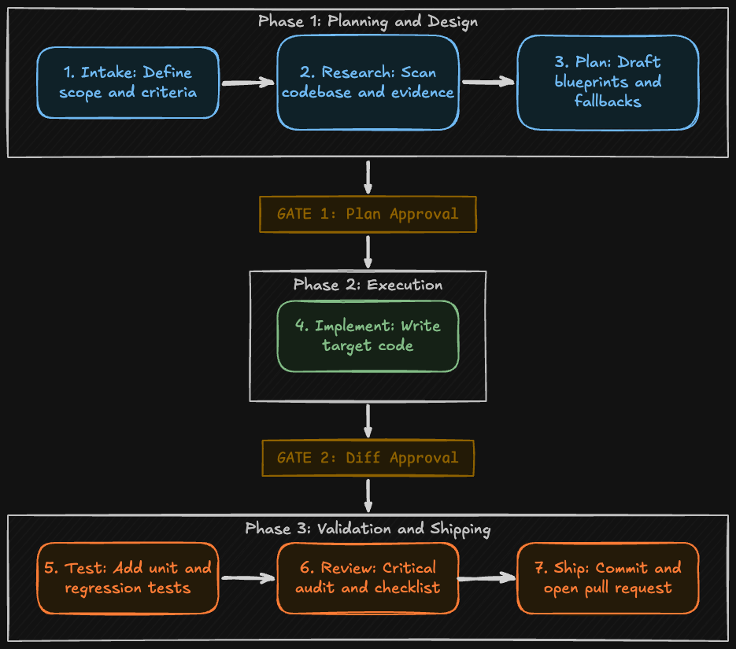

# AI Workflow Setup 🚀

An opinionated, enterprise-grade AI-assisted development workflow designed to go from **Ticket In** to **Reviewed PR Out**. 

This repository contains two parallel implementations of the exact same 7-stage software engineering pipeline:
1. 🤖 **Claude Code**: A fully automated, agentic flow that auto-chains each stage and queries for approval inline.
2. 💻 **GitHub Copilot Chat**: A developer-guided, semi-automated flow where you drive each stage manually with slash commands in your IDE.

The Next.js application in this repository acts as a sandbox for trying out these workflows. The configuration and intelligence live inside [.claude/](.claude/) and [.github/prompts/](.github/prompts/).

---

## 🧭 The 10-Stage Pipeline

Both clients enforce the exact same rigorous software engineering lifecycle:



| Stage | Name | Description |
|-------|------|-------------|
| 1 | **Intake** | Resolve the ticket, extract acceptance criteria, classify size and task type (Bug / Feature / Chore) |
| 2 | **Research** | Map the codebase, detect conventions, collect `file:line` evidence |
| 3 | **Root Cause Analysis** *(Bugs only)* | Trace the data flow, pinpoint the exact failing lines, present a structured RCA before planning |
| 4 | **Plan** | Write a step-by-step implementation plan with quality analysis, failure-mode table, and risk rating |
| — | **GATE 1: Approve Plan** | Human reviews and approves the plan before any code is written |
| 5 | **Solution Options** | Present 2–4 concrete solutions with pros/cons and a comparison matrix; human selects one |
| 6 | **Implement** | Execute the approved solution on a feature branch (uncommitted) |
| — | **GATE 2: Approve Diff** | Human reviews the diff and approves before tests run |
| 7 | **Test** | Run the test suite, add coverage, add regression tests for bug fixes |
| 8 | **Review** | Multi-step review: manual checklist → automated review pipeline (Opus) → acceptance criteria check → summary report |
| 9 | **Ship** | Self-review, QA, AI approval, commit, and open a PR |

### The Three Human Gates
- **GATE 1: Approve Plan**: The AI stops and presents a comprehensive plan citing files and line numbers. The human must review, refine, and approve the plan before any code is written.
- **Solution Selection**: The AI presents 2–4 concrete solution options with a comparison matrix. The human selects which approach to implement.
- **GATE 2: Approve Diff**: The AI implements the code and shows the complete diff. The human reviews and approves the changes before tests are executed and the code is prepared for shipping.

---

## ⚖️ Claude Code vs. GitHub Copilot Chat

| Feature | 🤖 Claude Code | 💻 GitHub Copilot Chat |
| :--- | :--- | :--- |
| **Workflow Style** | **Autonomous Agent** (Set & forget) | **Co-Pilot / Manual Drive** (Interactive) |
| **Orchestration** | Fully automated chaining of all stages | Manual, sequential invocation of slash commands |
| **Interface** | Terminal CLI (`claude` command line) | IDE Chat Panel (VS Code, Cursor, etc.) |
| **Gates Integration** | Inline interactive prompts (`AskUserQuestion`) | Plain Q&A between your invocations |
| **Context Management** | Agent worker loops with fresh context | Active chat session context propagation |
| **Best Used For** | Large features, complex debugging, hands-free automation | Small-to-medium tweaks, interactive refactoring, IDE-first flows |

---

## 🤖 Guide: Using Claude Code

**Claude Code** is Anthropic's agentic toolset and developer integration that has access to terminal execution, filesystem operations, and can run tools in sequence automatically.

### 1. Choose Your Interface & Setup

You can run Claude in your development environment using two primary methods:

#### Method A: Claude Code CLI (Terminal-First - Recommended)
The terminal-based CLI tool runs as an autonomous agent directly inside your terminal, letting it run tests, create branches, and write files:
1. Install the global npm package:
   ```bash
   npm install -g @anthropic-ai/claude-code
   ```
2. Log in and authenticate:
   ```bash
   claude
   ```

#### Method B: Claude IDE Extensions & Tools
If you prefer an IDE-first approach, you can install the **Claude Extension** or use AI-first editors like VS Code, Cursor, or Windsurf. These tools allow you to configure agentic behaviors and load context files (like `@AGENTS.md` and `@CLAUDE.md`) straight from your editor's sidebar panel.

---

### 2. Loaded Skills Registry

This repository comes pre-loaded with **10 custom AI skills** located under [.claude/skills/](.claude/skills/). 

When you launch `claude` in your terminal or IDE inside this workspace, Claude automatically scans the `.claude/skills/` directory and registers each folder as a custom slash command.

---

### 3. Running the Autonomous Flow
To run the full end-to-end flow with a single command, use the `/feature` orchestrator skill:
```bash
/feature ABC-123
```
*Note: You can pass a ticket ID (e.g., `ABC-123`), a URL to a Jira/Linear ticket, or a plain-text description.*

Claude will:
1. Run `/intake` to clarify goals and classify the task type (Bug / Feature / Chore).
2. Run `/research` to find code locations and collect evidence.
3. Run **Root Cause Analysis** inline if the ticket is a Bug — traces data flow and pinpoints failing lines before any planning.
4. Run `/plan` and present it to you.
5. **Pause (GATE 1)**: Wait for you to approve or request changes to the plan.
6. Present **2–4 Solution Options** with a comparison matrix. Wait for you to select one.
7. Run `/implement` to write code using the chosen solution.
8. **Pause (GATE 2)**: Wait for you to approve the file diff.
9. Run `/test` to verify changes.
10. Run `/review` — runs a manual checklist, the full automated review pipeline (using Opus model), acceptance criteria check, and produces a summary report.
11. Run `/ship` to commit and open a PR.

### 4. Running Individual Skills
If you want to run a single specific stage instead of the full pipeline, type the slash command directly in your Claude CLI session:

| Skill Command | Where It Lives | What It Does |
| :--- | :--- | :--- |
| **`/intake`** | [.claude/skills/intake](.claude/skills/intake/SKILL.md) | Clarifies user requirements into strict acceptance criteria (AC), size, and task type (Bug / Feature / Chore). |
| **`/research`** | [.claude/skills/research](.claude/skills/research/SKILL.md) | Explores codebase, builds hypotheses, and gathers `file:line` evidence. |
| **`/plan`** | [.claude/skills/plan](.claude/skills/plan/SKILL.md) | Produces an implementation plan with quality analysis + failure modes. For bugs, the orchestrator runs RCA first. |
| **`/implement`** | [.claude/skills/implement](.claude/skills/implement/SKILL.md) | Writes code changes directly on your feature branch (uncommitted) using the approved solution. |
| **`/refactor`** | [.claude/skills/refactor](.claude/skills/refactor/SKILL.md) | Executes behavior-preserving structural changes with green tests at each commit. |
| **`/debug`** | [.claude/skills/debug](.claude/skills/debug/SKILL.md) | Reproduces bugs deterministically and identifies the exact root cause. |
| **`/test`** | [.claude/skills/test](.claude/skills/test/SKILL.md) | Generates robust unit/integration tests and verifies test coverage. |
| **`/review`** | [.claude/skills/review](.claude/skills/review/SKILL.md) | Multi-step review: manual checklist → automated pipeline (Opus) → AC check → summary report. |
| **`/ship`** | [.claude/skills/ship](.claude/skills/ship/SKILL.md) | Final QA, self-review, commits changes, and opens a PR. |

---

## 💻 Guide: Using GitHub Copilot Chat

**Copilot Chat** uses prompt files defined in `.github/prompts/` to extend the chat assistant with customized behaviors and custom slash commands inside your IDE.

### 1. Prerequisites & Setup
1. Ensure you have **VS Code** and the **GitHub Copilot** extension installed.
2. Enable custom prompt files in your VS Code `settings.json`:
   ```json
   "chat.promptFiles": true
   ```
   *(Ensure you have this configured in your user or workspace settings. VS Code will automatically detect all `.prompt.md` files in `.github/prompts/`.)*

### 2. Loaded Prompts Registry
This repository comes pre-loaded with **10 custom prompt files** located under [.github/prompts/](.github/prompts/). When you open Copilot Chat in VS Code inside this workspace, each `.prompt.md` file is registered as a custom slash command automatically.

### 3. Running the Guided Flow (Manual Sequence)
Unlike Claude, Copilot does **not** auto-chain prompts. Running `/feature` will execute the intake step and stop. To run the full development lifecycle in Copilot, execute these commands **in sequence within the same chat session**:

```bash
/intake ABC-123  # 1. Resolve scope, AC, sizing, and task type (Bug/Feature/Chore)
/research        # 2. Search files and collect codebase file:line evidence
# ─── If Bug: manually perform RCA (trace data flow, quote failing lines) ───
/plan            # 3. Formulate the file-by-file design and implementation plan
# ─── ⚠️ GATE 1: Developer reviews and approves the plan ───
# ─── Present 2–4 solution options; developer selects one ───
/implement       # 4. Generate direct code edits using chosen solution (workspace remains uncommitted)
# ─── ⚠️ GATE 2: Developer reviews the target code changes (diff) ───
/test            # 5. Build, run, and strengthen test coverage 
/review          # 6. Manual checklist + automated pipeline (Opus) + AC check + summary
/ship            # 7. Package commits, final QA, and compose the PR description
```

You can trigger any of these prompts individually as needed. The template source files are fully accessible under [.github/prompts/](.github/prompts/).

---

## 🛠️ Repository Conventions

To get the most out of these AI agents and prompts, the repository follows these strict conventions:
- **No Early Commits**: `/implement` leaves changes uncommitted in the working tree. Only `/ship` performs a `git commit`.
- **Citing Code**: The AI must always cite files and line ranges (e.g., `app/page.tsx:L10-L15`) instead of giving vague descriptions.
- **Rules of the Road**: Both Claude and Copilot ingest [AGENTS.md](AGENTS.md) / [CLAUDE.md](CLAUDE.md) for local repository context and Next.js design guidelines.
