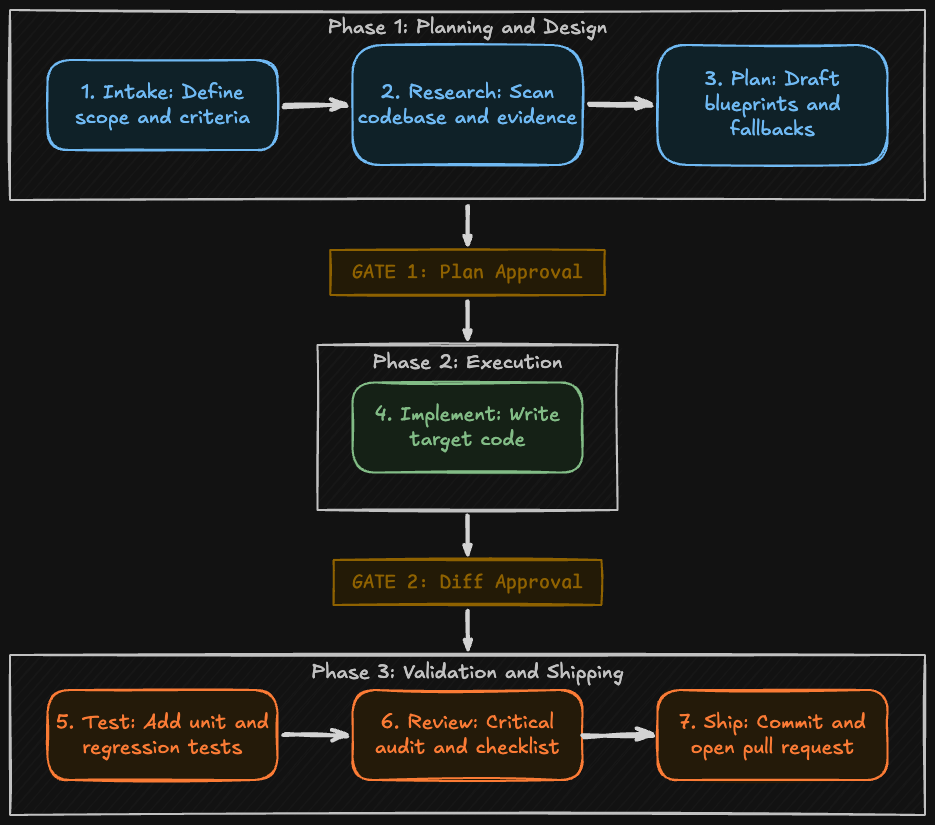

# AI Workflow Setup 🚀

An opinionated, enterprise-grade AI-assisted development workflow designed to go from **Ticket In** to **Reviewed PR Out**. 

This repository contains two parallel implementations of the exact same 7-stage software engineering pipeline:
1. 🤖 **Claude Code**: A fully automated, agentic flow that auto-chains each stage and queries for approval inline.
2. 💻 **GitHub Copilot Chat**: A developer-guided, semi-automated flow where you drive each stage manually with slash commands in your IDE.

The Next.js application in this repository acts as a sandbox for trying out these workflows. The configuration and intelligence live inside [.claude/](.claude/) and [.github/prompts/](.github/prompts/).

---

## 🧭 The 10-Stage Pipeline

Both clients enforce the exact same rigorous software engineering lifecycle:



| Stage | Name | Description |
|-------|------|-------------|
| 1 | **Intake** | Resolve the ticket, extract acceptance criteria, classify size and task type (Bug / Feature / Chore) |
| 2 | **Research** | Map the codebase, detect conventions, collect `file:line` evidence |
| 3 | **Root Cause Analysis** *(Bugs only)* | Trace the data flow, pinpoint the exact failing lines, present a structured RCA before planning |
| 4 | **Plan** | Write a step-by-step implementation plan with quality analysis, failure-mode table, and risk rating |
| — | **GATE 1: Approve Plan** | Human reviews and approves the plan before any code is written |
| 5 | **Solution Options** | Present 2–4 concrete solutions with pros/cons and a comparison matrix; human selects one |
| 6 | **Implement** | Execute the approved solution on a feature branch (uncommitted) |
| — | **GATE 2: Approve Diff** | Human reviews the diff and approves before tests run |
| 7 | **Test** | Run the test suite, add coverage, add regression tests for bug fixes |
| 8 | **Review** | Multi-step review: manual checklist → automated review pipeline (Opus) → acceptance criteria check → summary report |
| 9 | **Ship** | Self-review, QA, AI approval, commit, and open a PR |

### The Three Human Gates
- **GATE 1: Approve Plan**: The AI stops and presents a comprehensive plan citing files and line numbers. The human must review, refine, and approve the plan before any code is written.
- **Solution Selection**: The AI presents 2–4 concrete solution options with a comparison matrix. The human selects which approach to implement.
- **GATE 2: Approve Diff**: The AI implements the code and shows the complete diff. The human reviews and approves the changes before tests are executed and the code is prepared for shipping.

---

## ⚖️ Claude Code vs. GitHub Copilot Chat

| Feature | 🤖 Claude Code | 💻 GitHub Copilot Chat |
| :--- | :--- | :--- |
| **Workflow Style** | **Autonomous Agent** (Set & forget) | **Co-Pilot / Manual Drive** (Interactive) |
| **Orchestration** | Fully automated chaining of all stages | Manual, sequential invocation of slash commands |
| **Interface** | Terminal CLI (`claude` command line) | IDE Chat Panel (VS Code, Cursor, etc.) |
| **Gates Integration** | Inline interactive prompts (`AskUserQuestion`) | Plain Q&A between your invocations |
| **Context Management** | Agent worker loops with fresh context | Active chat session context propagation |
| **Best Used For** | Large features, complex debugging, hands-free automation | Small-to-medium tweaks, interactive refactoring, IDE-first flows |

---

## 🤖 Guide: Using Claude Code

**Claude Code** is Anthropic's agentic toolset and developer integration that has access to terminal execution, filesystem operations, and can run tools in sequence automatically.

### 1. Choose Your Interface & Setup

You can run Claude in your development environment using two primary methods:

#### Method A: Claude Code CLI (Terminal-First - Recommended)
The terminal-based CLI tool runs as an autonomous agent directly inside your terminal, letting it run tests, create branches, and write files:
1. Install the global npm package:
   ```bash
   npm install -g @anthropic-ai/claude-code
   ```
2. Log in and authenticate:
   ```bash
   claude
   ```

#### Method B: Claude IDE Extensions & Tools
If you prefer an IDE-first approach, you can install the **Claude Extension** or use AI-first editors like VS Code, Cursor, or Windsurf. These tools allow you to configure agentic behaviors and load context files (like `@AGENTS.md` and `@CLAUDE.md`) straight from your editor's sidebar panel.

---

### 2. Install the Workflow as a Plugin (Use It in Any Project)

The 10 workflow skills are also packaged as the **`dev-workflow`** Claude Code plugin, published through this repo's own marketplace (`ai-automation-jira-marketplace`). Installing it makes the commands available in **any** project, not just this repo — no need to copy `.claude/skills/` around.

| File | Purpose |
| :--- | :--- |
| [.claude-plugin/marketplace.json](.claude-plugin/marketplace.json) | Declares the `ai-automation-jira-marketplace` marketplace and the plugins it offers |
| [plugins/dev-workflow/.claude-plugin/plugin.json](plugins/dev-workflow/.claude-plugin/plugin.json) | Plugin manifest for `dev-workflow` |
| [plugins/dev-workflow/skills/](plugins/dev-workflow/skills/) | The skills shipped in the plugin |
| [plugins/dev-workflow/agents/](plugins/dev-workflow/agents/) | Four model-routed subagents: `lead`, `scout`, `reviewer`, `reviewer-deep` |
| [plugins/dev-workflow/hooks/](plugins/dev-workflow/hooks/) | Opt-in `PreToolUse` push gate: blocks direct pushes to protected branches once a project adds `.claude/push-gate.conf` |

Size and Risk scoring, which model runs which step, the push-gate config and the usage-limit fallbacks are documented in [docs/AGENTIC_WORKFLOW.md](docs/AGENTIC_WORKFLOW.md).

#### First-time setup

1. Add the marketplace:
   ```bash
   claude plugin marketplace add pruthvidarji1993/ai-automation-jira
   ```
2. Install the plugin:
   ```bash
   claude plugin install dev-workflow@ai-automation-jira-marketplace
   ```
3. **Restart Claude** so the plugin takes effect.

#### Getting future updates

Whenever the workflow is updated in this repo:

1. Re-sync the cached marketplace with the latest changes:
   ```bash
   claude plugin marketplace update ai-automation-jira-marketplace
   ```
2. Update the installed plugin:
   ```bash
   claude plugin update dev-workflow@ai-automation-jira-marketplace
   ```
3. Restart Claude to load the new version.

**Updating is all a project has to do.** The agents and the push gate ship inside the plugin, so steps 1-3 above bring everything in; there is nothing to copy and no settings to edit. Two things to know after updating to v1.1.0:

- **Nothing about how you push changes.** The protected-branch push gate is opt-in: it only turns on in a project that adds `.claude/push-gate.conf` (see [docs/AGENTIC_WORKFLOW.md](docs/AGENTIC_WORKFLOW.md#protected-branch-push-gate)).
- **No settings are required.** Agents pin their own models. Optionally, add `{ "model": "opusplan" }` to a project's `.claude/settings.json` to get Opus in plan mode and Sonnet elsewhere; a plugin cannot set that for you.

**Check you are on the new version:**

```bash
claude plugin list        # dev-workflow should show Version: 1.1.0
```

#### What's new in v1.1.0

| What you will notice | Why it matters |
| :--- | :--- |
| `intake` prints a `Risk:` line (`normal` or `high`) with a one-line reason | Tasks touching auth, money, deletes or migrations always get the full workflow and a deeper review, even when the change is tiny |
| Bug root cause runs in a separate Opus agent (`dev-workflow:lead`) | More careful diagnosis; the main session's context stays small |
| On medium/large or high-risk tasks the plan is drafted by `lead` too | Plan quality does not depend on which model your session uses |
| `research` sends small read-only lookups to a cheaper model (medium/large tasks) | Lower cost for the same evidence |
| `review` and `ship` use fresh-context reviewers; high risk gets the Opus reviewer. `lead` then re-checks every finding against the real code | Fewer false alarms, and the author never reviews their own code |
| Every plan ends with a `Done when` checklist with proof per line | A run is finished when every line is ticked with evidence, not when every stage has run |
| Optional push gate (off unless `.claude/push-gate.conf` exists) | Teams that want it can block direct pushes to `main` / `develop` from Claude |

Unchanged: the slash commands, the stage order and all three human gates.

Full detail, including the Size/Risk table and usage-limit fallbacks: [docs/AGENTIC_WORKFLOW.md](docs/AGENTIC_WORKFLOW.md).

#### If something looks off

- Run `claude plugin list` to confirm the version, then restart Claude. Plugin updates only apply after a restart.
- Remove the plugin with `claude plugin uninstall dev-workflow@ai-automation-jira-marketplace`, and reinstall with the first-time setup steps above.
- Tell the maintainer which skill and stage it happened in.

> 💡 Plugin skills are namespaced by the plugin name, so they may appear as `/dev-workflow:feature`, `/dev-workflow:intake`, etc. Type `/` in Claude to see the exact names available.

---

### 3. Loaded Skills Registry

This repository comes pre-loaded with **10 custom AI skills** located under [.claude/skills/](.claude/skills/). 

When you launch `claude` in your terminal or IDE inside this workspace, Claude automatically scans the `.claude/skills/` directory and registers each folder as a custom slash command.

---

### 4. Running the Autonomous Flow
To run the full end-to-end flow with a single command, use the `/feature` orchestrator skill:
```bash
/feature ABC-123
```
*Note: You can pass a ticket ID (e.g., `ABC-123`), a URL to a Jira/Linear ticket, or a plain-text description.*

Claude will:
1. Run `/intake` to clarify goals and classify the task type (Bug / Feature / Chore).
2. Run `/research` to find code locations and collect evidence.
3. Run **Root Cause Analysis** inline if the ticket is a Bug — traces data flow and pinpoints failing lines before any planning.
4. Run `/plan` and present it to you.
5. **Pause (GATE 1)**: Wait for you to approve or request changes to the plan.
6. Present **2–4 Solution Options** with a comparison matrix. Wait for you to select one.
7. Run `/implement` to write code using the chosen solution.
8. **Pause (GATE 2)**: Wait for you to approve the file diff.
9. Run `/test` to verify changes.
10. Run `/review` — runs a manual checklist, the full automated review pipeline (using Opus model), acceptance criteria check, and produces a summary report.
11. Run `/ship` to commit and open a PR.

### 5. Running Individual Skills
If you want to run a single specific stage instead of the full pipeline, type the slash command directly in your Claude CLI session:

| Skill Command | Where It Lives | What It Does |
| :--- | :--- | :--- |
| **`/intake`** | [.claude/skills/intake](.claude/skills/intake/SKILL.md) | Clarifies user requirements into strict acceptance criteria (AC), size, and task type (Bug / Feature / Chore). |
| **`/research`** | [.claude/skills/research](.claude/skills/research/SKILL.md) | Explores codebase, builds hypotheses, and gathers `file:line` evidence. |
| **`/plan`** | [.claude/skills/plan](.claude/skills/plan/SKILL.md) | Produces an implementation plan with quality analysis + failure modes. For bugs, the orchestrator runs RCA first. |
| **`/implement`** | [.claude/skills/implement](.claude/skills/implement/SKILL.md) | Writes code changes directly on your feature branch (uncommitted) using the approved solution. |
| **`/refactor`** | [.claude/skills/refactor](.claude/skills/refactor/SKILL.md) | Executes behavior-preserving structural changes with green tests at each commit. |
| **`/debug`** | [.claude/skills/debug](.claude/skills/debug/SKILL.md) | Reproduces bugs deterministically and identifies the exact root cause. |
| **`/test`** | [.claude/skills/test](.claude/skills/test/SKILL.md) | Generates robust unit/integration tests and verifies test coverage. |
| **`/review`** | [.claude/skills/review](.claude/skills/review/SKILL.md) | Multi-step review: manual checklist → automated pipeline (Opus) → AC check → summary report. |
| **`/ship`** | [.claude/skills/ship](.claude/skills/ship/SKILL.md) | Final QA, self-review, commits changes, and opens a PR. |

---

## 💻 Guide: Using GitHub Copilot Chat

**Copilot Chat** uses prompt files defined in `.github/prompts/` to extend the chat assistant with customized behaviors and custom slash commands inside your IDE.

### 1. Prerequisites & Setup
1. Ensure you have **VS Code** and the **GitHub Copilot** extension installed.
2. Enable custom prompt files in your VS Code `settings.json`:
   ```json
   "chat.promptFiles": true
   ```
   *(Ensure you have this configured in your user or workspace settings. VS Code will automatically detect all `.prompt.md` files in `.github/prompts/`.)*

### 2. Loaded Prompts Registry
This repository comes pre-loaded with **10 custom prompt files** located under [.github/prompts/](.github/prompts/). When you open Copilot Chat in VS Code inside this workspace, each `.prompt.md` file is registered as a custom slash command automatically.

### 3. Running the Guided Flow (Manual Sequence)
Unlike Claude, Copilot does **not** auto-chain prompts. Running `/feature` will execute the intake step and stop. To run the full development lifecycle in Copilot, execute these commands **in sequence within the same chat session**:

```bash
/intake ABC-123  # 1. Resolve scope, AC, sizing, and task type (Bug/Feature/Chore)
/research        # 2. Search files and collect codebase file:line evidence
# ─── If Bug: manually perform RCA (trace data flow, quote failing lines) ───
/plan            # 3. Formulate the file-by-file design and implementation plan
# ─── ⚠️ GATE 1: Developer reviews and approves the plan ───
# ─── Present 2–4 solution options; developer selects one ───
/implement       # 4. Generate direct code edits using chosen solution (workspace remains uncommitted)
# ─── ⚠️ GATE 2: Developer reviews the target code changes (diff) ───
/test            # 5. Build, run, and strengthen test coverage 
/review          # 6. Manual checklist + automated pipeline (Opus) + AC check + summary
/ship            # 7. Package commits, final QA, and compose the PR description
```

You can trigger any of these prompts individually as needed. The template source files are fully accessible under [.github/prompts/](.github/prompts/).

---

## 🛠️ Repository Conventions

To get the most out of these AI agents and prompts, the repository follows these strict conventions:
- **No Early Commits**: `/implement` leaves changes uncommitted in the working tree. Only `/ship` performs a `git commit`.
- **Citing Code**: The AI must always cite files and line ranges (e.g., `app/page.tsx:L10-L15`) instead of giving vague descriptions.
- **Rules of the Road**: Both Claude and Copilot ingest [AGENTS.md](AGENTS.md) / [CLAUDE.md](CLAUDE.md) for local repository context and Next.js design guidelines.
